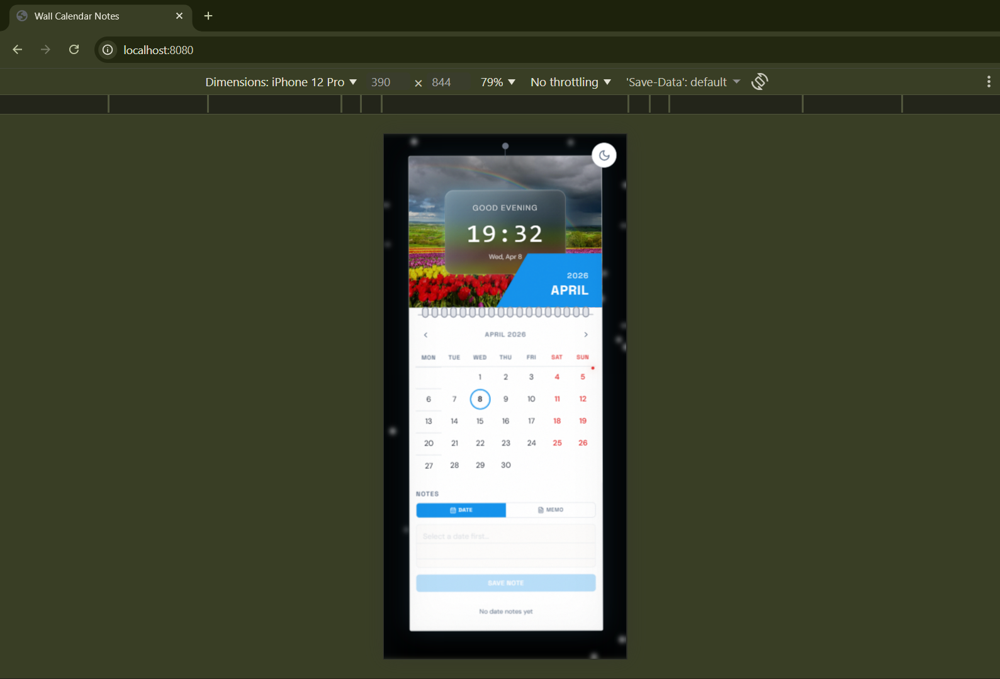
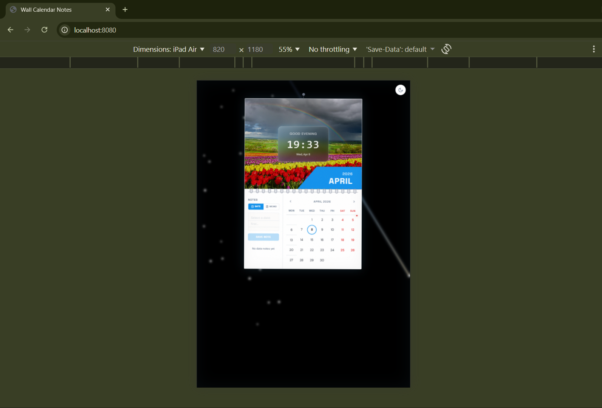
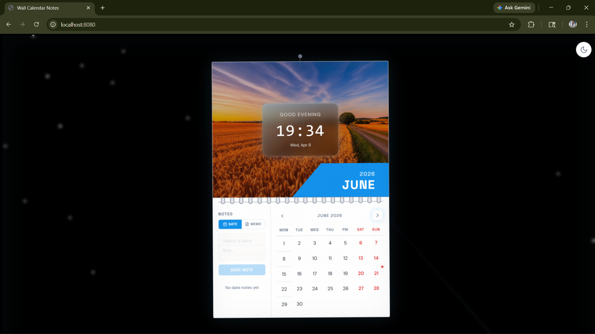
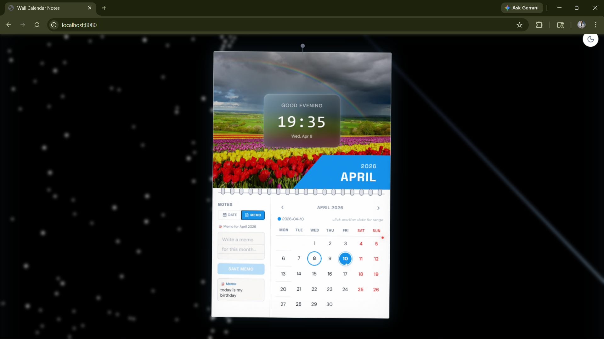
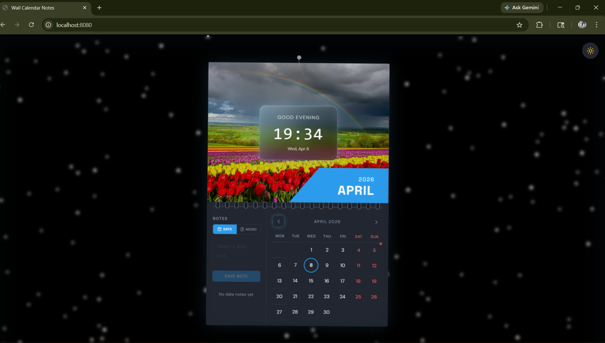

# 📅 Wall Calendar Notes

A beautiful, interactive wall calendar application with smooth animations, dark mode support, and an immersive space-themed background. Built with React, TypeScript, and Framer Motion.


---

## ✨ Features

### 📆 Calendar Features

- **Interactive Monthly Calendar** - Navigate through months with smooth page flip animations
- **Date Notes** - Add, edit, and delete notes for specific dates
- **Date Range Selection** - Select and manage date ranges with visual indicators
- **Holiday Tracking** - Automatic detection and display of holidays
- **Month Memo** - Add monthly memos at the top of each calendar page
- **Dark Mode Support** - Toggle between light and dark themes with persistent state

### 🎨 Visual Effects & Animations

- **Smooth Page Flip Animation** - Realistic 360° page flip with ease-in-out timing (1 second duration)
- **Glass Morphism UI** - Modern frosted glass design with backdrop blur and glowing effects
- **Space Background** - Animated starfield with:
  - Dense star generation (3500px² density)
  - Twinkling effects with smooth opacity transitions
  - Shooting stars with dynamic trails
  - Parallax effect synchronized with mouse movement
  - Dark/Light mode adaptive colors
- **Mouse Parallax Effect** - Calendar content responds to mouse movement with different speeds
- **Wall Hanging Effect** - Animated swing motion simulating a real wall calendar
- **Smooth Transitions** - All interactions use carefully tuned spring physics

### 🎵 Audio Effects

- **Paper Flip Sound** - Satisfying audio feedback on page turns

### 🌍 Dark Mode

- **Automatic Theme Detection** - Respects system dark mode preference
- **Manual Toggle** - Easy theme switcher in the UI
- **Persistent State** - Remembers your theme preference

---

## 📸 Screenshots







---

## �📁 Project Structure

```
wall-calendar-notes-main/
├── src/
│   ├── components/
│   │   ├── NavLink.tsx              # Navigation routing component
│   │   ├── SpaceBackground.tsx      # Animated starfield canvas
│   │   ├── calendar/
│   │   │   ├── CalendarGrid.tsx     # Monthly calendar grid layout
│   │   │   ├── CalendarHeader.tsx   # Month/year header with controls
│   │   │   ├── CalendarPage.tsx     # Full calendar page component
│   │   │   ├── DayCell.tsx          # Single day cell with notes
│   │   │   ├── HeroImage.tsx        # Month hero image display
│   │   │   ├── NotesPanel.tsx       # Side panel for note editing
│   │   │   ├── PageFlipHero.tsx     # Hero section with page flip
│   │   │   ├── PageFlipper.tsx      # Page flip animation logic
│   │   │   ├── SpiralBinding.tsx    # Spiral binding decoration
│   │   │   ├── ThemeToggle.tsx      # Dark/light mode switcher
│   │   │   ├── WallClock.tsx        # Analog clock display
│   │   │   ├── WallHook.tsx         # Wall hook decoration
│   │   ├── ui/                      # shadcn/ui components library
│   │   │   ├── accordion.tsx        # Expandable sections
│   │   │   ├── button.tsx           # Button components
│   │   │   ├── card.tsx             # Card containers
│   │   │   ├── dialog.tsx           # Modal dialogs
│   │   │   ├── input.tsx            # Text input fields
│   │   │   ├── label.tsx            # Form labels
│   │   │   ├── textarea.tsx         # Multi-line text input
│   │   │   └── ...                  # Additional UI components
│   ├── hooks/
│   │   ├── useCalendar.ts           # Calendar state management
│   │   ├── useHolidays.ts           # Holiday detection logic
│   │   ├── useMouseParallax.ts      # Mouse parallax tracking
│   │   ├── useSoundEffect.ts        # Audio playback hook
│   │   ├── use-mobile.tsx           # Mobile detection
│   │   └── use-toast.ts             # Toast notifications
│   ├── lib/
│   │   └── utils.ts                 # Utility functions
│   ├── pages/
│   │   ├── Index.tsx                # Main calendar page
│   │   └── NotFound.tsx             # 404 page
│   ├── test/
│   │   ├── example.test.ts          # Test examples
│   │   └── setup.ts                 # Test setup
│   ├── assets/
│   │   └── months/                  # Month hero images
│   ├── App.tsx                      # Main app component
│   ├── App.css                      # App styles
│   ├── index.css                    # Global styles
│   ├── main.tsx                     # App entry point
│   └── vite-env.d.ts                # Vite environment types
├── public/
│   ├── robots.txt                   # SEO robots file
│   └── placeholder.svg              # Placeholder images
├── Configuration Files
│   ├── package.json                 # Dependencies & scripts
│   ├── tsconfig.json                # TypeScript configuration
│   ├── vite.config.ts               # Vite builder config
│   ├── tailwind.config.ts           # Tailwind CSS config
│   ├── postcss.config.js            # PostCSS configuration
│   ├── eslint.config.js             # ESLint rules
│   ├── vitest.config.ts             # Test runner config
│   ├── playwright.config.ts         # E2E test config
│   └── components.json              # shadcn/ui config
├── index.html                       # HTML entry point
├── README.md                        # This file
└── bun.lockb                        # Bun lock file
```

---

## 🚀 Quick Start

### Prerequisites

- **Node.js** (v18 or higher)
- **npm** or **bun** package manager

### Installation

1. **Clone the repository**

   ```bash
   git clone https://github.com/yourusername/wall-calendar-notes.git
   cd wall-calendar-notes-main
   ```

2. **Install dependencies**

   ```bash
   npm install
   # or
   bun install
   ```

3. **Start development server**

   ```bash
   npm run dev
   # or
   bun run dev
   ```

4. **Open your browser**
   ```
   http://localhost:5173
   ```

### Build for Production

```bash
npm run build
# or
bun run build
```

### Preview Production Build

```bash
npm run preview
# or
bun run preview
```

---

## 🎬 Animation Effects

### Page Flip Animation

- **Duration**: 1 second
- **Easing**: ease-in-out (smooth, natural motion)
- **Type**: 360° rotateX flip
- **Staggered Effects**:
  - Shadow fold effect (0.05s delay)
  - Lighting dimming (0.08s delay)
  - Drop shadow expansion (0.1s delay)
- **Result**: Realistic paper page turning with depth

### Mouse Parallax

- **Background Speed**: 50% of mouse movement
- **Calendar Speed**: 120% of mouse movement (faster than background for depth)
- **Range**: -20px to 20px offset
- **Physics**: Spring-based animation (stiffness: 100, damping: 30)

### Space Background

- **Star Density**: 1 star per 3500px²
- **Star Sizes**: 2.0-3.0px diameter (highly visible)
- **Twinkling**: Subtle sine-wave opacity (0.9-1.0 range)
- **Shooting Stars**: 6-10px/frame speed with 120-frame lifetime
- **Parallax**: Synced with mouse movement
- **Canvas Scaling**: 1.4x scale to prevent white edges during parallax

### Glass Morphism

- **Backdrop Blur**: Small blur effect
- **Inset Glow**: Blue-tinted glowing shadow
- **Transparency**: Dark gradient overlay with opacity
- **Border Shine**: Subtle white edge highlight

### Wall Hanging

- **Swing Animation**: Continuous gentle swing motion
- **Origin**: Top center (hanging from a hook)
- **Binding**: Spiral binding decoration at the top

---

## 🛠️ Setup & Configuration

### Environment Variables

Create a `.env` file (if needed):

```env
VITE_APP_TITLE=Wall Calendar Notes
```

### Tailwind CSS

Customization in `tailwind.config.ts`:

```typescript
theme: {
  extend: {
    colors: { /* custom colors */ },
    animation: { /* custom animations */ }
  }
}
```

### Dark Mode

- Automatic detection via `dark` class on `<html>`
- Toggle in UI updates class dynamically
- Affects background star colors and overlay opacity

---

## 📦 Dependencies

### Core

- **React** - UI library
- **React Router** - Client-side routing
- **Framer Motion** - Animation engine
- **Tailwind CSS** - Utility-first CSS

### UI Components

- **shadcn/ui** - Pre-built component library
- **Radix UI** - Headless UI components
- **Sonner** - Toast notifications

### Forms & Validation

- **React Hook Form** - Form state management
- **Zod** - Schema validation

### Development

- **TypeScript** - Static type checking
- **Vite** - Fast build tool
- **ESLint** - Code quality
- **Vitest** - Unit testing
- **Playwright** - E2E testing

---

## 🎨 Customization

### Change Colors

Edit `src/App.css` and `tailwind.config.ts`:

```css
/* Glow colors */
--glow-color: rgba(100, 200, 255, 0.1);
```

### Modify Animation Duration

In `src/components/calendar/PageFlipper.tsx`:

```typescript
const dur = 1.0; // Change duration in seconds
```

### Adjust Parallax Speed

In `src/hooks/useMouseParallax.ts`:

```typescript
x: normalizedX * 20, // Increase/decrease for more/less movement
```

---

## 📸 Screenshots & Features

### Screen Sections

1. **Header** - Month/Year display with navigation arrows
2. **Hero Image** - Beautiful month-specific imagery
3. **Calendar Grid** - 7-day week layout with dates
4. **Wall Hook** - Decorative top element simulating wall mounting
5. **Notes Panel** - Collapsible side panel for note editing
6. **Theme Toggle** - Dark/Light mode switcher

### Interactive Elements

- Click dates to add notes
- Drag to select date ranges
- Click month arrows to flip pages
- Toggle theme in top-right corner
- Expand notes panel for detailed editing

### Visual Hierarchy

- Large, readable calendar numbers
- Highlighted dates with notes
- Different styles for holidays
- Smooth transitions between states

---

## 🔧 Scripts

```bash
# Development
npm run dev              # Start dev server
npm run build            # Production build
npm run preview          # Preview production build

# Code Quality
npm run lint             # Run ESLint
npm run test             # Run tests once
npm run test:watch       # Watch mode testing
```

---

## 📱 Browser Support

- Chrome/Edge (latest)
- Firefox (latest)
- Safari (latest)
- Mobile browsers (iOS/Android)

---

## 🎯 Features in Detail

### Calendar Management

- Click dates to add notes
- Edit existing notes
- Delete notes with confirmation
- View all notes for a date
- Select date ranges for planning

### Monthly Navigation

- Previous/Next month buttons
- Smooth page flip transition
- Audio feedback on page turn
- Holiday highlighting

### Theme Customization

- Light mode with subtle colors
- Dark mode with space theme
- System preference detection
- Manual toggle in top-right

---

## 📝 License

MIT License - Feel free to use this project for personal or commercial purposes.

---

## 🤝 Contributing

Contributions are welcome! Feel free to:

1. Fork the repository
2. Create a feature branch
3. Make your changes
4. Submit a pull request

---

## 📧 Support

For issues, feature requests, or questions, please open an issue on GitHub.

---

## 🙌 Acknowledgments

- **Framer Motion** for smooth animations
- **shadcn/ui** for beautiful components
- **Tailwind CSS** for responsive design
- **React** community for amazing ecosystem

---

**Happy Planning! 📅✨**
